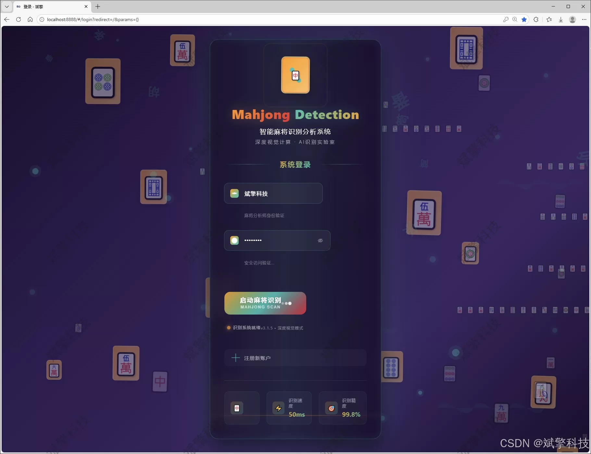
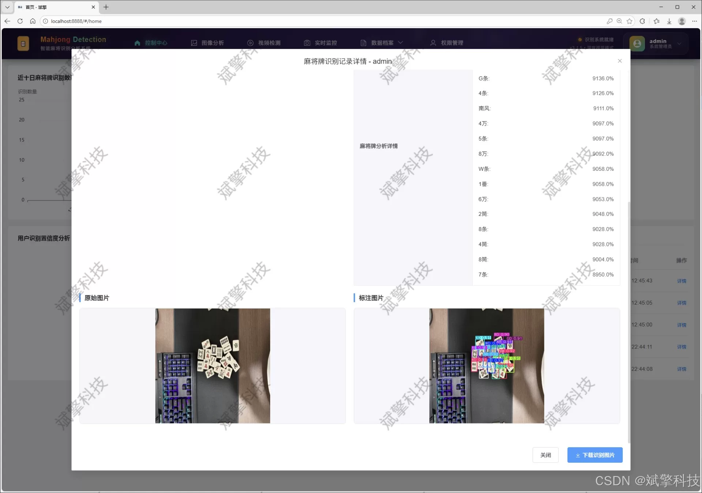
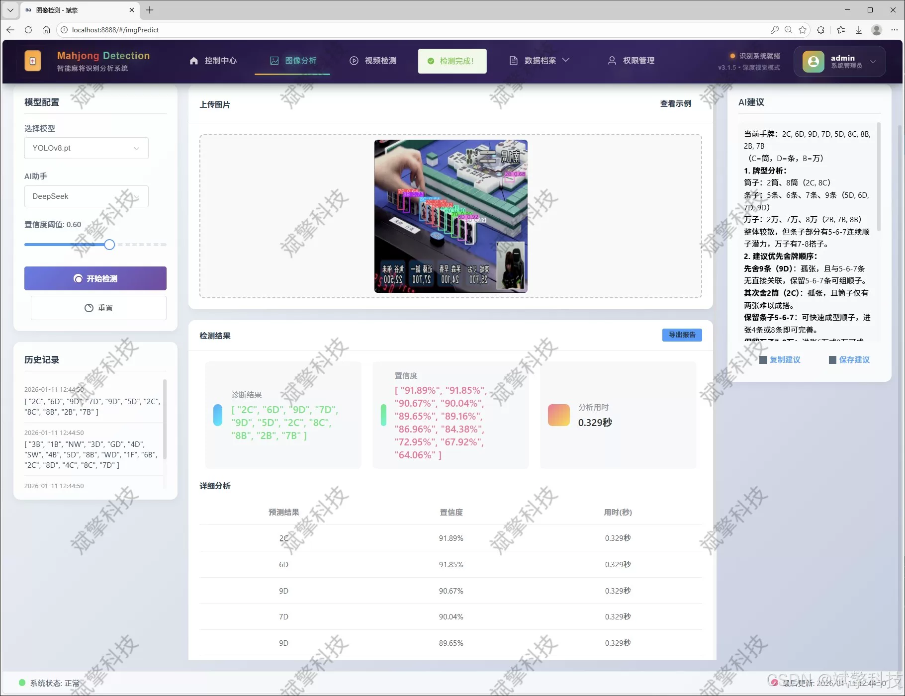
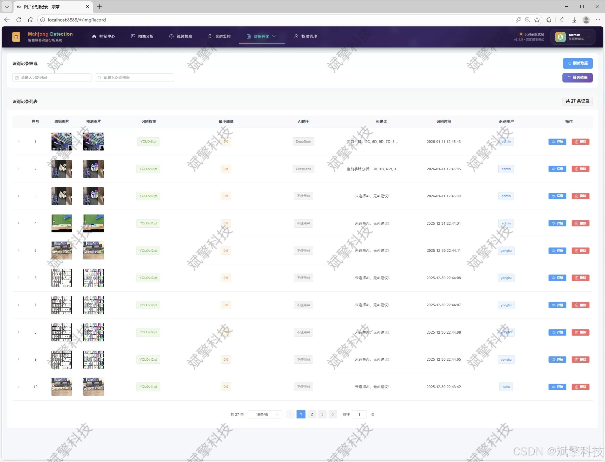
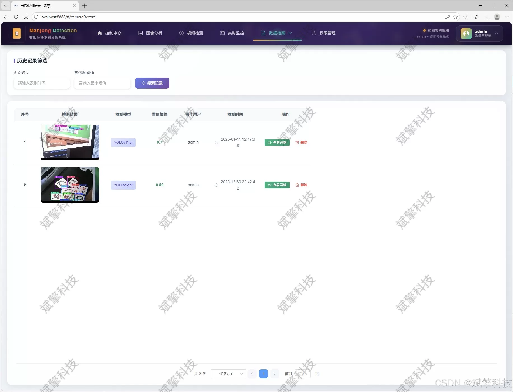
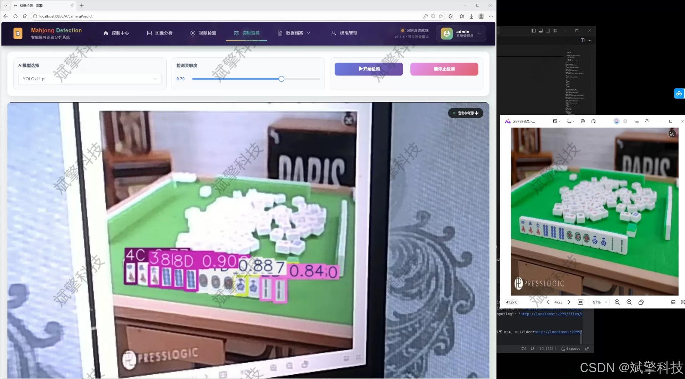
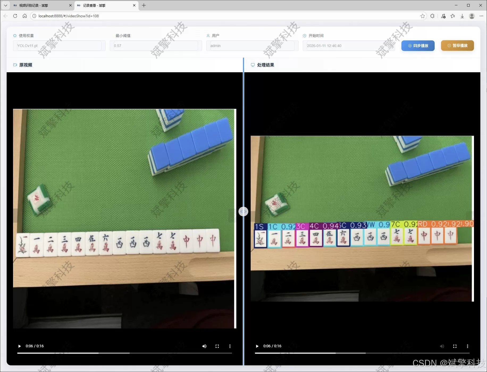
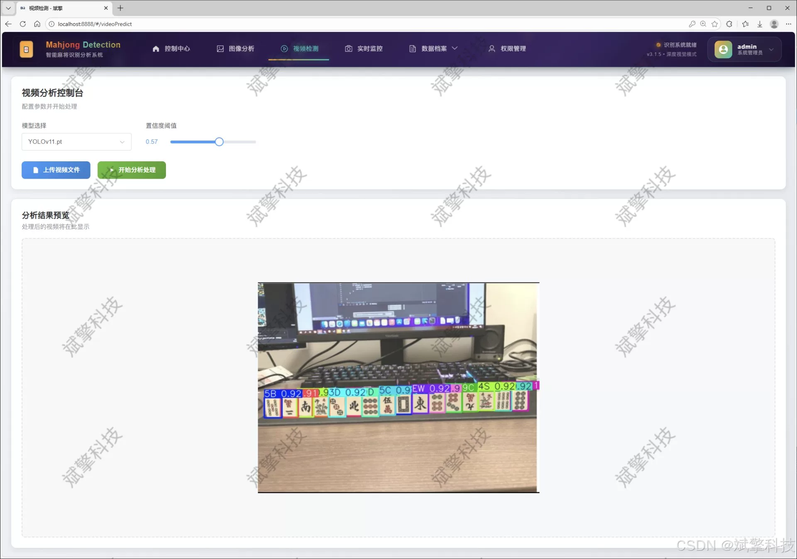
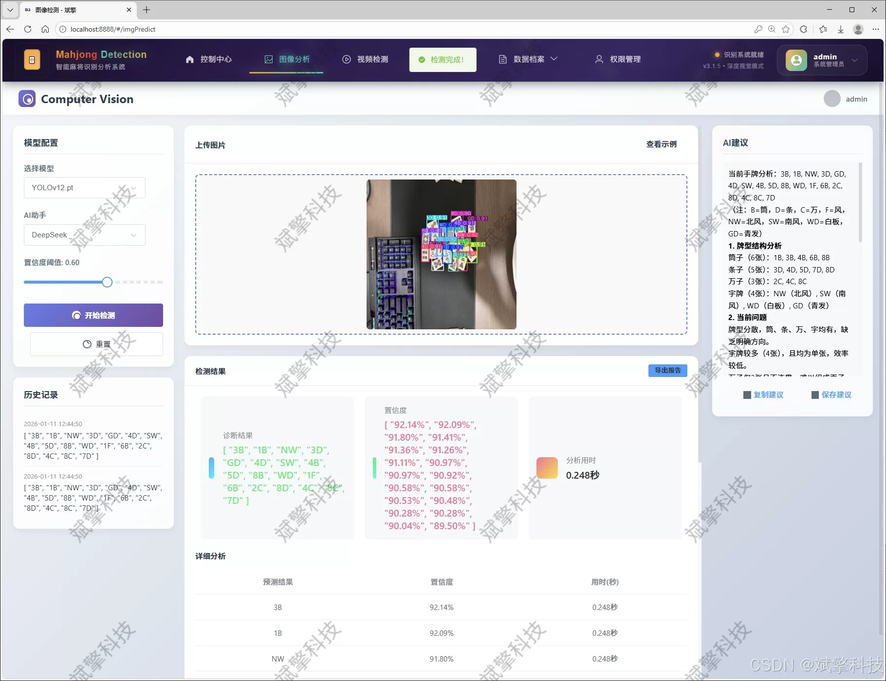

# YOLO Multi-Model Mahjong Recognition System

## Body

The YOLO multi-model Mahjong recognition system is based on the YOLO deep learning and the Mahjong recognition detection system (DeepSeek intelligent analysis + web interaction interface + front-end separation + YOLO data + YOLOv8/YOLOv10/YOLOv11/YOLOv12).

As the digital development of traditional Chinese intellectual games deepens, mahjong, a representative national culture, has important application value in its intelligent recognition and analysis technology. This study designs and implements a mahjong card intelligent recognition system based on deep learning and modern Web architecture, specifically targeting 42 standard mahjong patterns for high-precision detection and classification. The system innovatively integrates four advanced target detection models: YOLOv8, YOLOv10, YOLOv11, and YOLOv12, building a flexible switching multi-model recognition engine. By constructing a specialized mahjong dataset containing 6731 high-quality labeled images covering various patterns such as the "wan", "tiao", "zhuang", "feng", and "jia" cards, the data support for precise model training is provided. The backend uses SpringBoot microservice framework, combined with a front-end-back-end separation architecture, to realize a complete user management system, multimodal detection functions, and intelligent analysis modules. A DeepSeek large language model is particularly introduced to provide board analysis for recognition results. All detection records and operation data are stored persistently in MySQL database, ensuring traceability and data security. Experimental results show that this system can maintain excellent recognition performance under complex backgrounds, multiple card overlaps, and different lighting conditions, providing innovative technical solutions for online mahjong games, intelligent teaching, cultural heritage, and entertainment applications.

Functional module

✅ User Login and Registration: Supports password detection, saves to MySQL database.

✅ Supports four YOLO model switches, YOLOv8, YOLOv10, YOLOv11, YOLOv12.

✅ Information Visualization, Data Visualization.

✅ Image detection supports AI analysis functions, deepseek and Qianwen.

✅ Supports image detection, video detection, and real-time camera detection. The results are saved to a MySQL database.

✅ Picture recognition record management, video recognition record management and camera recognition record management.

✅ User Management Module, administrators can add, delete, modify, and query users.

✅ Personal center, can modify their own information, password name profile picture and so on.

There is no Lunwen writing service, nor any Lunwen.

## Images

## Payment

Here is a pay link on Stripe ( https://buy.stripe.com/3cs8yP7sY87d0vu9AB ). Please contact me lonlonago@foxmail.com after funding $89, and I will send you a complete data files , thank you!

